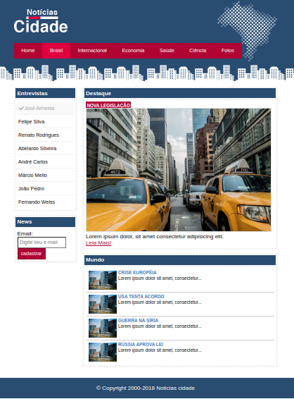
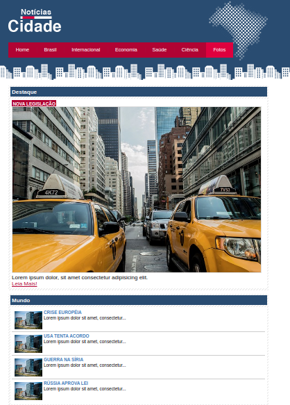

# Projeto 4 - TecBlog
Este projeto se trata de um site de notícias. Com esse projeto, eu pude testar os conhecimentos e aplicar os elementos como:

- Aprofundamento de seletores
- Herança e especificidade
- Barra de navegação vertical e horizontal
- Marcador de página atual
- Navegação com abas
- Layout de figura fixa
- Layout líquido
- Imagens líquidas
- Coluna Falsa
- Estilização de tabelas
- Estilização de formulários
- Arredondamento com imagens

