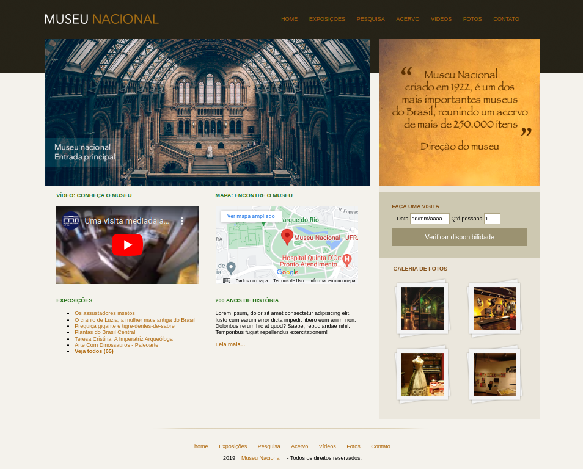

# Projeto 6 - Museu Nacional

Este projeto se trata de um site de um Museu. Com esse projeto, eu pude testar os conhecimentos e aplicar os elementos como:

- Parallax
- Aplicando fontes customizadas
- Normalize CSS
- Box Sizing & Cantos arredondados
- Degradês & Transparências
- Sombras
- Animações
- Transições
- Novas tags html 5 Header, Nav, Footer, Article, Section, Aside e time
- Compatibilidade Html 5
- Novas tags de Input
- Flexbox - container

