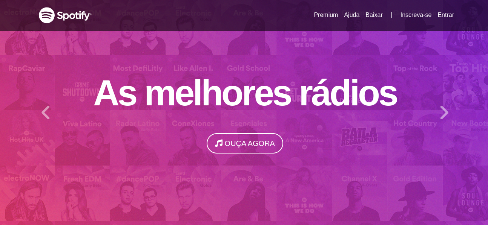
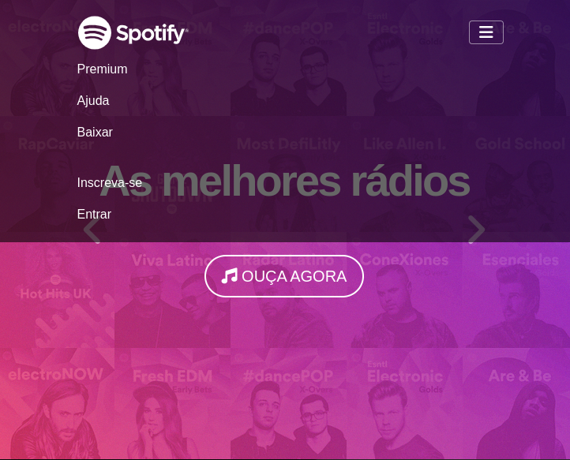
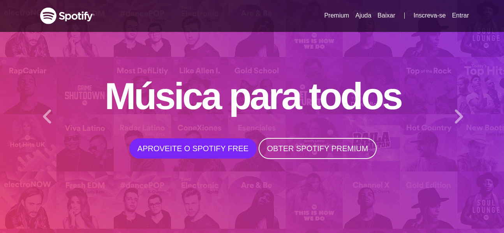
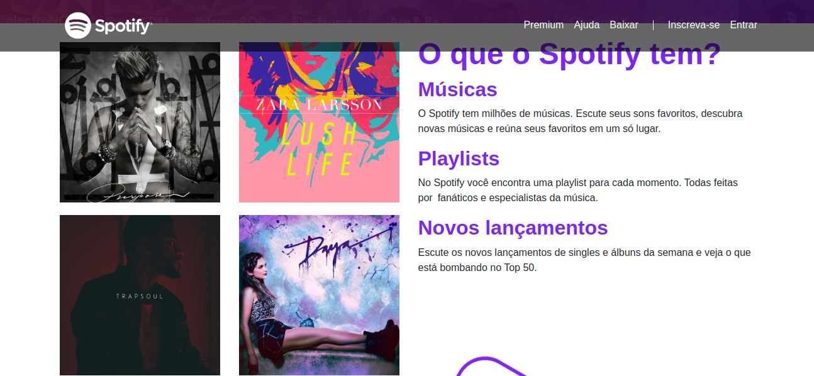
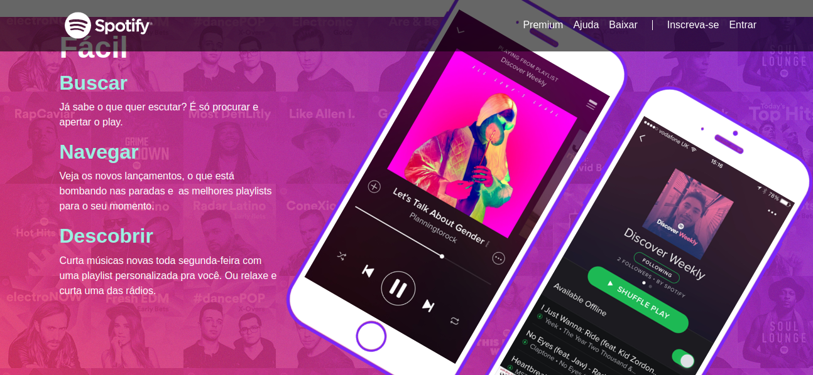
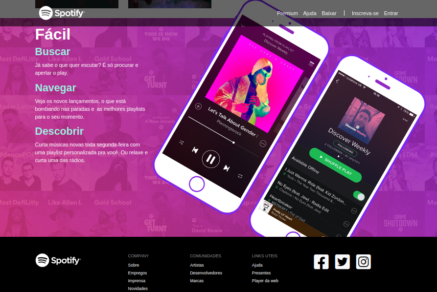

# Projeto 8 - Spotify

Este projeto se trata de uma réplica do site Spotify. Com esse projeto, eu pude testar os conhecimentos e aplicar os elementos como:

##Design responsivo & Bootstrap

- Formatação de textos
- Alinhamento de textos
- Elementos flutuantes
- Cores
- Backgrounds
- Margin & Padding
- Tamanhos
- Bordas
- Media Queries
- Botões
- Barra de Navegação
- Listas
- Formulários
- Input Group
- Alertas
- Barra de progresso
- Tabelas & Paginação
- Cards
- Jumbotron
- Alinhamento de Imagens
- Icones
- Configurações & Alinhamento de Grid
- Flexbox
- Margin & Wrap
- Carousel

