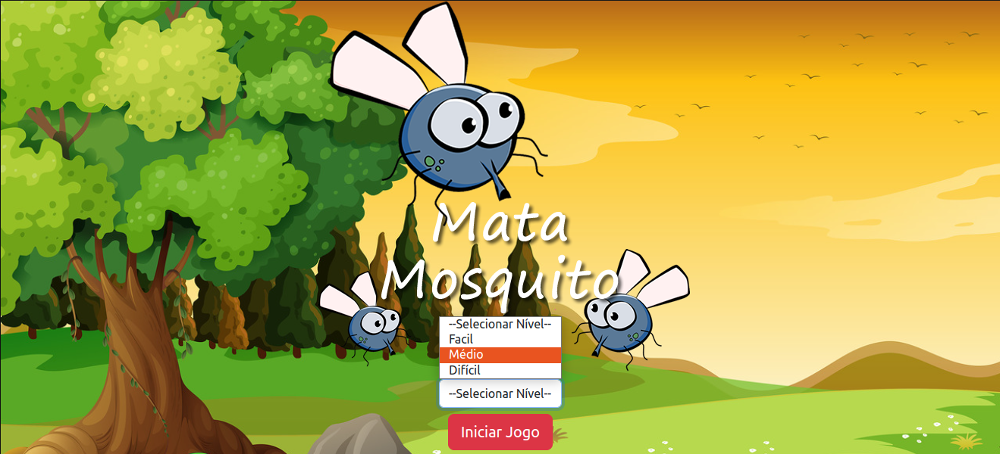
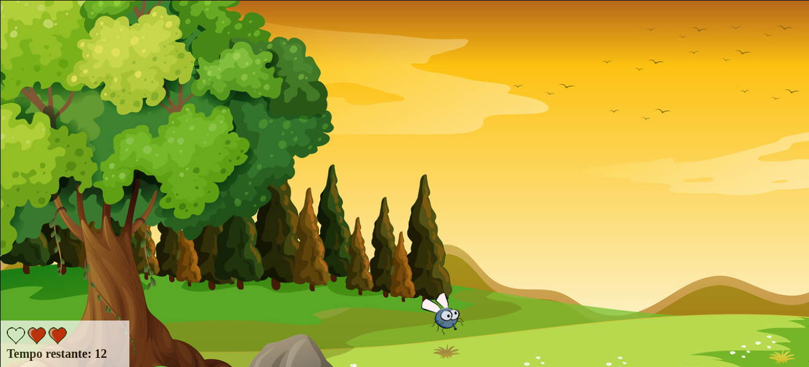
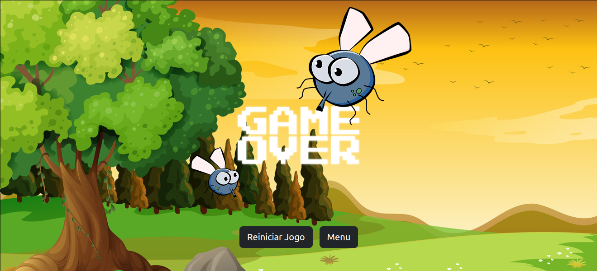

# Projeto 9 - Mata mosquito

Este projeto se trata de uma réplica de um jogo chamado Mata mosquito. Com esse projeto, eu pude testar os conhecimentos e aplicar os elementos como:

##Java Script
- Variáveis
- Concatenação
- Operadores Lógicos, condicionais
- Desvios condicionais
- Casting
- Operador ternário
- Precedência
- Funções
- Escopo
- Funcões anônimas e técnica de wrapper
- Funcões de callback
- Eventos
- DOM
- Arrays
- Estruturas de repetição
- Parâmetros variáveis
- Try, Catch, Throw e Finally
- BOM

